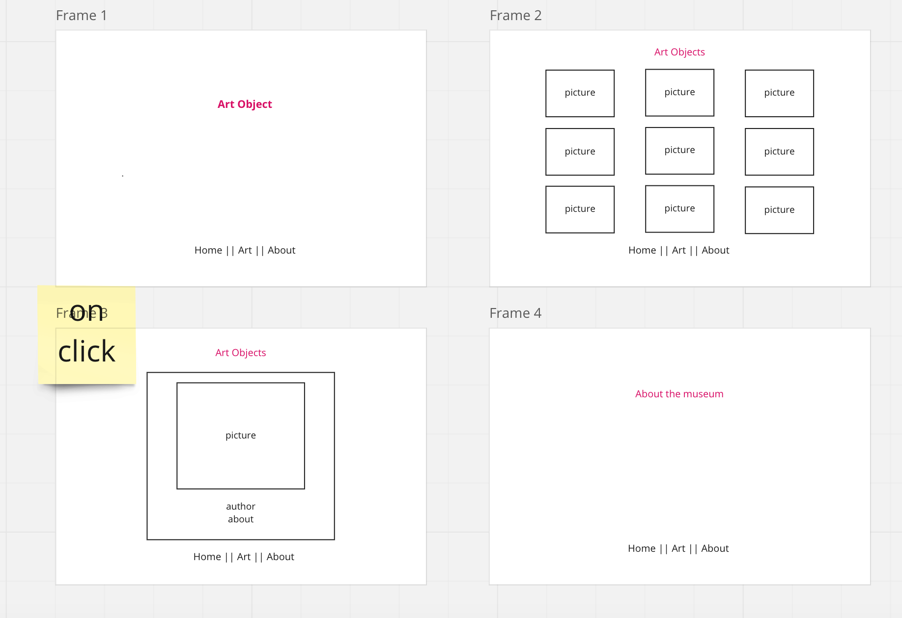
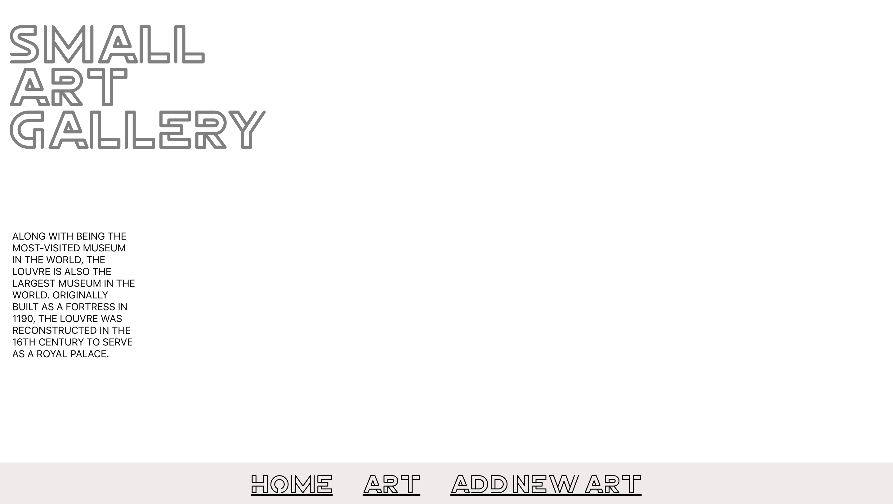
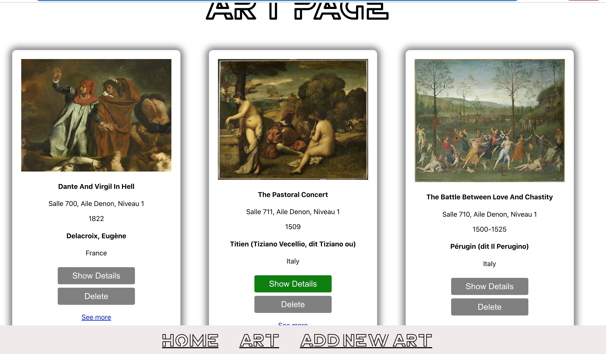
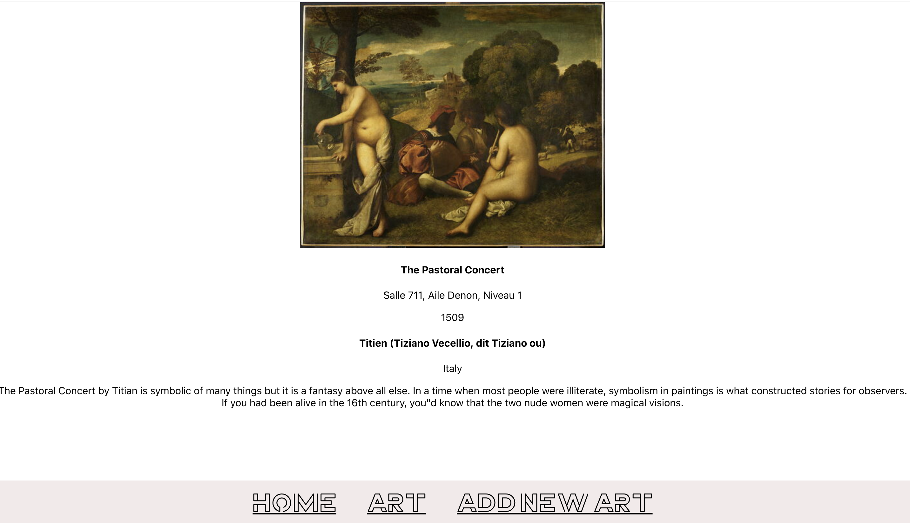
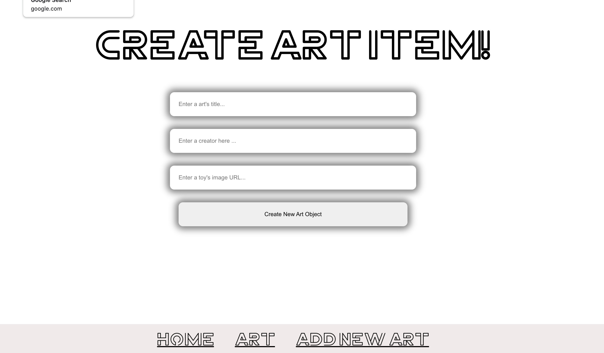

# Art Object

* As a user I can click on NavBar menu 
* In NavBar Menu you can click on the art object and see details about this object
* As user I can click on "about" in NavBar and see information about the museum.
  
  All requariments for the project were completed. Here is final product:
  
  
  
  
